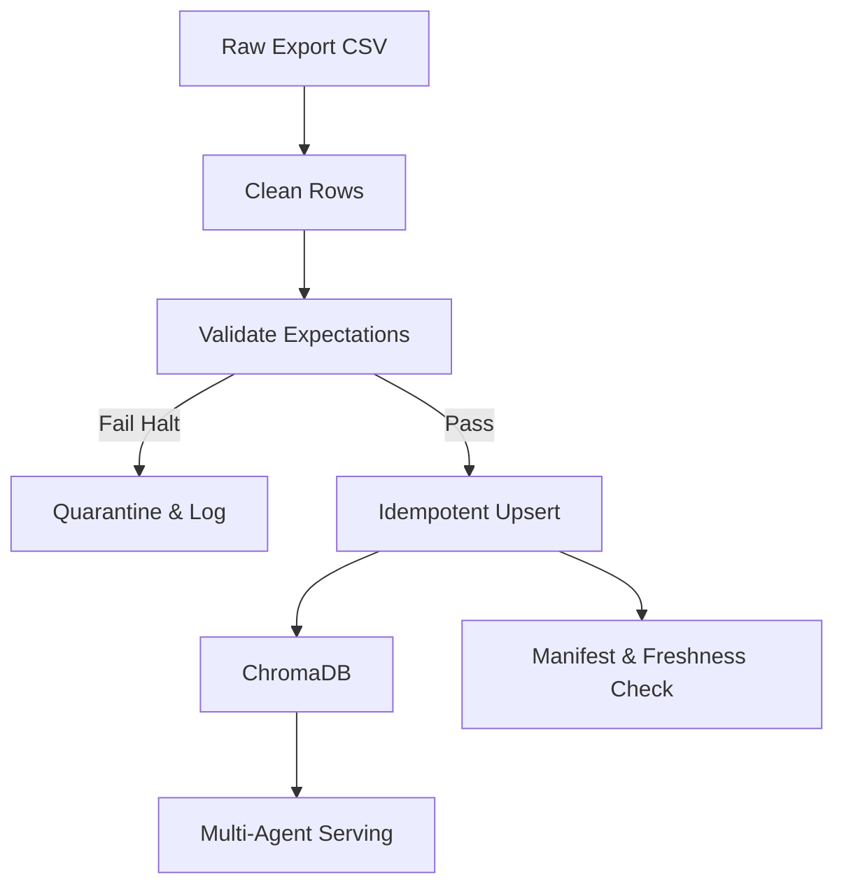

# Kiến trúc pipeline — Lab Day 10

**Nhóm:** Cá nhân (Học viên)  
**Cập nhật:** 2026-06-10

---

## 1. Sơ đồ luồng (bắt buộc có 1 diagram: Mermaid / ASCII)

Điểm đo **freshness** nằm ở cuối pipeline khi tạo ra file manifest. Nó kiểm tra `latest_exported_at` so với thời gian chạy. 
Mỗi lần chạy sẽ sinh ra `run_id` được ghi vào log, manifest, csv, và cả metadata của vector. Dữ liệu lỗi được chuyển sang file **quarantine**.

---

## 2. Ranh giới trách nhiệm

| Thành phần | Input | Output | Owner nhóm |
|------------|-------|--------|--------------|
| Ingest | `policy_export_dirty.csv` | File log, run_id | Học viên |
| Transform | List of dicts raw | Cleaned rows, Quarantine rows | Học viên |
| Quality | Cleaned rows | Expectation Results, Halt flag | Học viên |
| Embed | Cleaned rows | Upserted ChromaDB Collection | Học viên |
| Monitor | Manifest file | Freshness status (PASS/FAIL) | Học viên |

---

## 3. Idempotency & rerun

Cơ chế Idempotent Upsert sử dụng hàm `client.upsert(ids=..., documents=...)` của ChromaDB, khóa (key) dựa vào `chunk_id` có được từ quá trình hash (md5) nội dung tĩnh của tài liệu. 
Rerun 2 lần (hoặc nhiều lần) sẽ KHÔNG bị duplicate vector vì ChromaDB tự động update/override vector nếu `chunk_id` đã tồn tại. Thêm vào đó, ở bước Clean, hàm có thêm quá trình prune (xóa các chunk_id cũ không còn trong cleaned dataset) để tránh lỗi mồi cũ.

---

## 4. Liên hệ Day 09

Pipeline này đóng vai trò ETL hoàn chỉnh để tạo ra collection `day10_kb`. Khác với day 09 (dùng file text/markdown tĩnh), day 10 ingest từ bản export thô có chứa policy cũ và rác. Việc nhúng (embed) sẽ đổ thẳng vào ChromaDB để AI Retrieval tool ở Day 09 có thể dùng lại thông qua Collection Name. Nhờ đó agent truy xuất được context "sạch sẽ".

---

## 5. Rủi ro đã biết

- Hệ thống mã hóa (Encoding/Unicode): Log của python khi gặp ký tự tiếng việt hoặc ký tự đặc biệt có thể crash hệ thống (Windows cp1252), yêu cầu phải set PYTHONUTF8=1 hoặc lọc nội dung.
- Dữ liệu rác cực lớn/dài: Expectation chỉ kiểm tra chiều dài chunk ngắn, chưa filter chunk vượt qua giới hạn độ dài của token.
- Phụ thuộc lớn vào Expectation Rules: Cần con người hard-code rule. Nếu có dạng "rác" mới, hệ thống vẫn nhúng vào DB.
